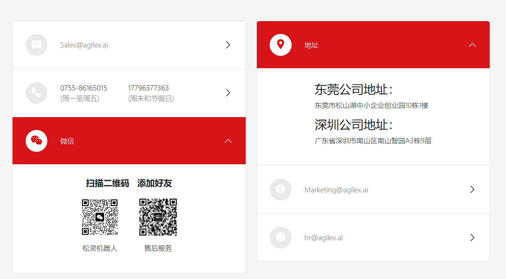

# mobile-aloha

# 1 环境配置

1. 下载cobot-magic工程
~~~python
git clone https://github.com/agilexrobotics/cobot_magic.git
~~~

2. 编译
~~~python
cd cobot_magic/remote_control
./tools/build.sh

cd cobot_magic/camera_ws
catkin_make
~~~

2. 测试

~~~python
# 1 setup rule
ls /dev/ttyACM*

udevadm info -a -n /dev/ttyACM* | grep serial -m 1

sudo vim /etc/udev/rules.d/arx_can.rules

sudo udevadm control --reload && sudo  udevadm trigger

# 2 start remote arm
cd remote_control
./tools/can.sh

cd master1

source devel/setup.bash

roslaunch arm_control arx5v.launch
~~~

# 3 采集数据

~~~python
# 1 启动roscore
roscore

# 2 启动机器臂与相机
./tools/remote.sh

## 3 采集数据
python collect_data.py --max_timesteps 500 --dataset_dir ./data --episode_idx 0
~~~

# 4 模型训练推理

~~~python
# 1 激活虚拟环境
conda activate aloha

# 2 训练
python act/train.py --dataset_dir ~/data0314/ --ckpt_dir ~/train0314/ --batch_size 4 --num_epochs 3000

# 3 推理
## 3.1 只启动从臂
cd remote_control
./tools/puppet.sh

## 3.2 启动推理代码
python act/inference.py --ckpt_dir ~/train0314/
~~~

---

# 联系我们

